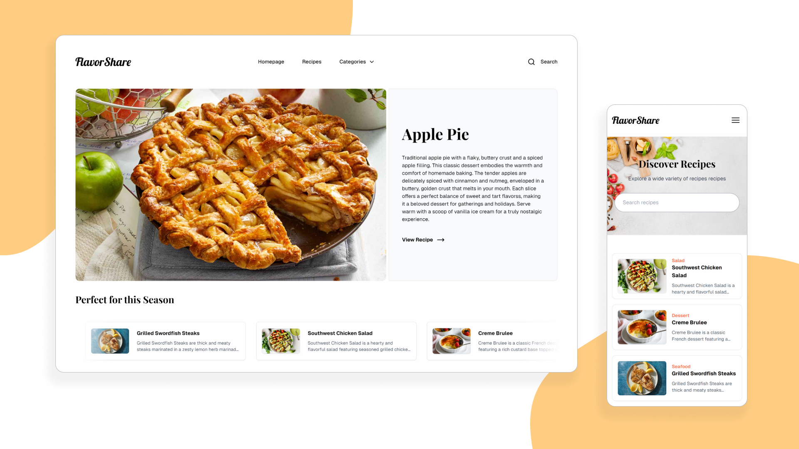

# FlavorShare
Your ultimate destination for culinary exploration and creativity. Discover a vast array of recipes from everyday meals to gourmet delights, curated by food lovers worldwide. Browse by cuisine, ingredient, or dietary preference, and find your next favorite dish. - ChatGPT



<p align="center">
https://nemaas-flavorshare.vercel.app
</p>

## **Run it locally**
```
git clone https://github.com/NoelEmaas/recipe-app.git
cd recipe-app
npm install
npm run dev
```

or you can build and run it for a faster performance
```
npm run build
npm run start
```

## **Tech Stack Used**


